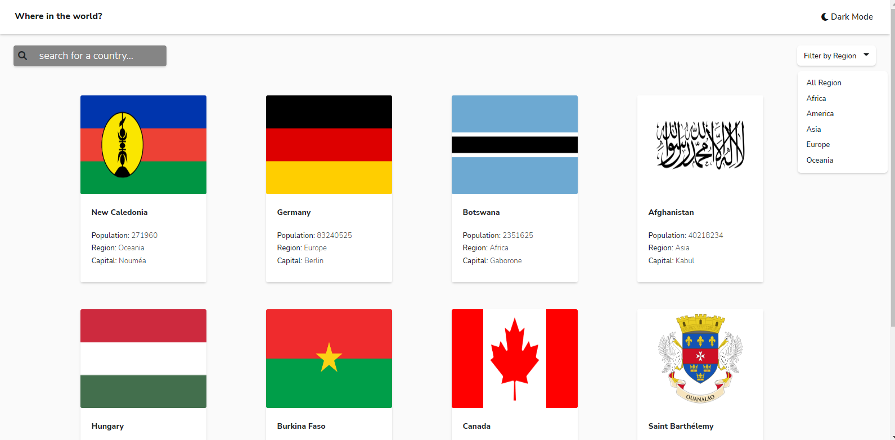
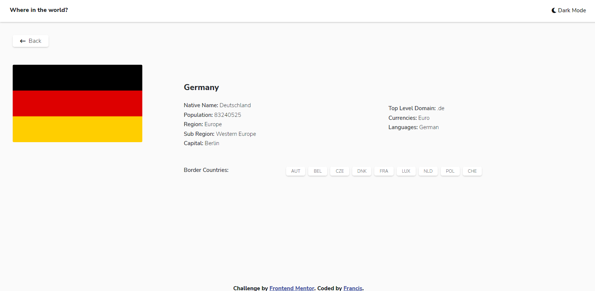
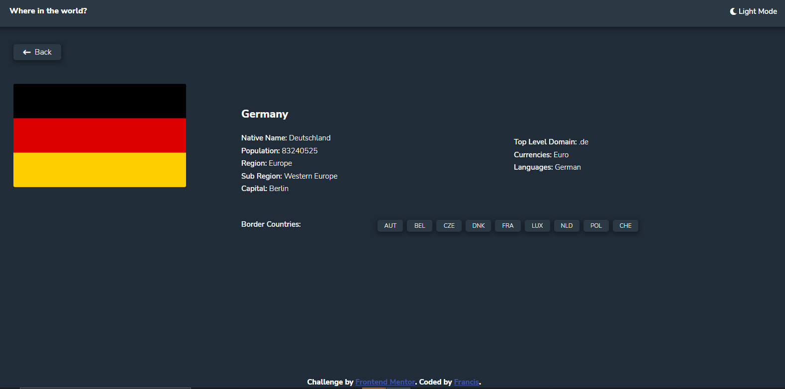
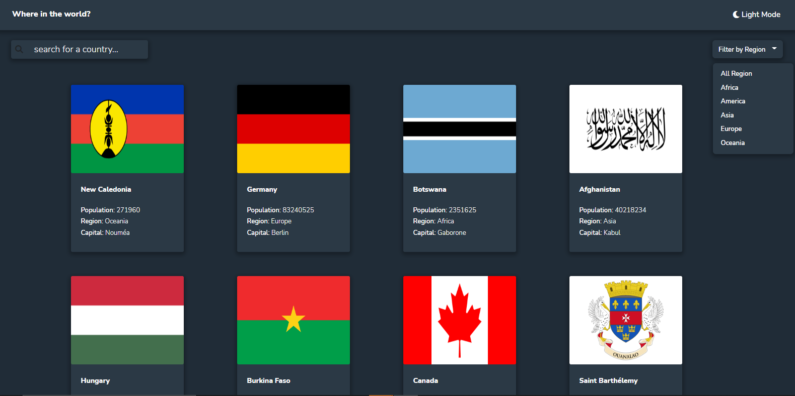

# Frontend Mentor - REST Countries API with color theme switcher solution

This is a solution to the [REST Countries API with color theme switcher challenge on Frontend Mentor](https://www.frontendmentor.io/challenges/rest-countries-api-with-color-theme-switcher-5cacc469fec04111f7b848ca). Frontend Mentor challenges help you improve your coding skills by building realistic projects. 

## Table of contents

- [Overview](#overview)
  - [The challenge](#the-challenge)
  - [Screenshot](#screenshot)
  - [Links](#links)
- [My process](#my-process)
  - [Built with](#built-with)
- [Author](#author)

**Note: Delete this note and update the table of contents based on what sections you keep.**

## Overview

### The challenge

Users should be able to:

- See all countries from the API on the homepage
- Search for a country using an `input` field
- Filter countries by region
- Click on a country to see more detailed information on a separate page
- Click through to the border countries on the detail page
- Toggle the color scheme between light and dark mode *(optional)*

### Screenshot

### Links

- Solution URL: [View live solution here](https://github.com/Bluebberies/rest-countries-api)
- Live Site URL: [View live site here](https://rest-countries-api-neon-beta.vercel.app/)

### Built with

- Semantic HTML5 markup
- CSS custom properties
- Flexbox
- CSS Grid
- Mobile-first workflow
- Bootstrap
- [React](https://reactjs.org/) - JS library
- [Styled Components](https://styled-components.com/) - For styles

## Author

- Frontend Mentor - [@yourusername](https://www.frontendmentor.io/profile/Bluebberies)
- LinkedIn - [@Francis Okonkwo](https://www.linkedin.com/in/francis-okonkwo-51a388232/)
- Twitter - [@fran__cies](https://twitter.com/fran__cies)
- Facebook - [@ Fran Cis](https://web.facebook.com/francis.okonkwo.946517)
- Instagram - [@fran__cies](https://www.instagram.com/fran__cies/)